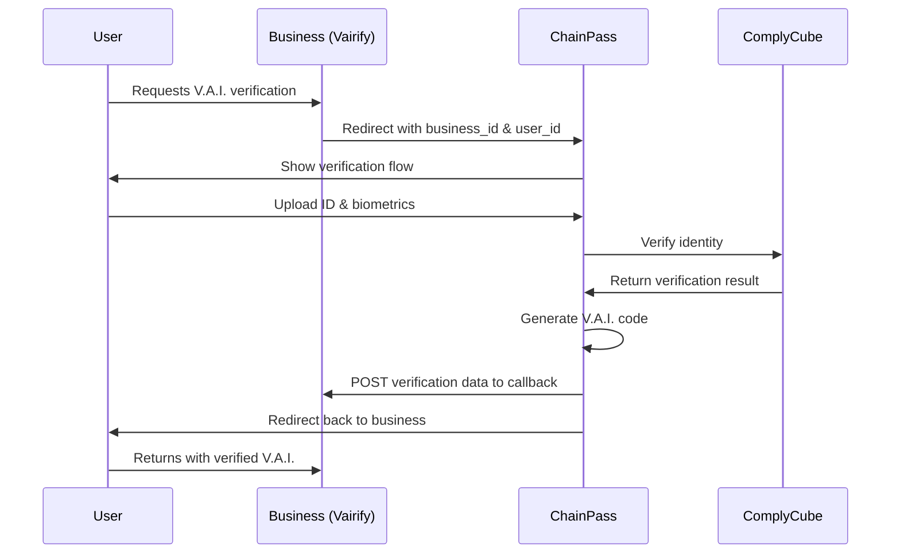

# ChainPass Business Integration Guide

## Overview

ChainPass now supports multi-tenant V.A.I. verification, allowing business partners (like Vairify) to redirect users for verification and receive the results via callback.

## Integration Flow



## For Business Partners

### 1. Register Your Business

Add your business configuration to `src/config/businessRegistry.ts`:

```typescript
export const BUSINESS_REGISTRY: BusinessRegistry = {
  'your-business-id': {
    name: 'Your Business Name',
    callback_url: 'https://your-api.com/receive-vai-verification',
    api_key: 'your-api-key',
    return_url: 'https://your-site.com/verification-complete',
    environments: {
      dev: {
        callback_url: 'https://dev.your-api.com/receive-vai-verification',
        return_url: 'https://dev.your-site.com/verification-complete',
      },
      prod: {
        callback_url: 'https://your-api.com/receive-vai-verification',
        return_url: 'https://your-site.com/verification-complete',
      },
    },
  },
};
```

### 2. Redirect Users to ChainPass

**URL Format:**
```
https://chainpass.id/?business_id=your-business-id&user_id={uuid}
```

**Parameters:**
- `business_id` (required): Your registered business identifier
- `user_id` (required): Your internal user UUID

**Example:**
```javascript
const redirectToChainPass = (userId) => {
  window.location.href = `https://chainpass.id/?business_id=vairify&user_id=${userId}`;
};
```

### 3. Implement Callback Endpoint

ChainPass will POST verification results to your `callback_url`.

**Request Headers:**
```
Content-Type: application/json
apikey: {your-api-key}
```

**Request Payload:**
```json
{
  "user_id": "uuid-string",
  "vai_number": "CIV-XXXXX" or "LEO-XXXXX",
  "biometric_photo_url": "https://...",
  "complycube_transaction_number": "transaction-id",
  "le_disclosure_accepted": true/false,
  "signature_agreement_accepted": true/false
}
```

**Success Response (200):**
```json
{
  "success": true,
  "message": "V.A.I. verification received",
  "verification_id": "uuid"
}
```

**Error Response (400/500):**
```json
{
  "error": "Error message description"
}
```

### 4. Handle User Return

After successful callback, ChainPass redirects the user back to your `return_url`. Handle this in your application:

```javascript
// On your verification-complete page
const handleVerificationComplete = () => {
  // User has completed V.A.I. verification
  // Their verified data has been sent to your callback endpoint
  // Proceed with your application flow
};
```

## For ChainPass (Internal)

### Architecture

**Components:**
1. **Business Registry** (`src/config/businessRegistry.ts`) - Configuration for all business partners
2. **Session Manager** (`src/utils/sessionManager.ts`) - Stores business context throughout flow
3. **Business Callback** (`src/utils/businessCallback.ts`) - Handles sending data to partners
4. **Edge Function** (`supabase/functions/send-to-business/index.ts`) - Server-side callback handler
5. **Verification Flow** (`src/components/VerificationFlow.tsx`) - Detects and processes redirects
6. **Success Pages** (`src/pages/VaiSuccess.tsx`, `src/pages/LEOVaiSuccess.tsx`) - Send callbacks

### Session Flow

1. **Incoming Redirect**: `VerificationFlow` component detects `business_id` and `user_id` parameters
2. **Validation**: Checks business exists in registry
3. **Storage**: Saves business context to localStorage
4. **Verification**: User completes standard V.A.I. flow
5. **Callback**: Success page automatically sends verification data to business
6. **Redirect**: User returned to business's `return_url`

### Error Handling

The callback system includes:
- **3 automatic retries** with exponential backoff (1s, 2s, 4s)
- **30-second timeout** per request
- **Graceful degradation** if callback fails (user can continue)
- **Detailed logging** for debugging

### Testing

**Test URL:**
```
http://localhost:5173/?business_id=vairify&user_id=test-user-123
```

**What to verify:**
1. Toast notification appears confirming business redirect
2. V.A.I. verification completes normally
3. Callback is sent to business endpoint (check console)
4. User redirects to business return URL

## Security Considerations

1. **API Keys**: Never expose API keys in client-side code
2. **User ID Preservation**: Never modify the `user_id` received from business
3. **Business Validation**: Always validate `business_id` against registry
4. **Data Isolation**: Ensure complete data isolation between businesses
5. **HTTPS Only**: All callback URLs must use HTTPS
6. **Biometric URLs**: Ensure photo URLs are publicly accessible to business

## Adding New Business Partners

1. Add configuration to `businessRegistry.ts`
2. Test with development URLs first
3. Verify callback endpoint works correctly
4. Switch to production URLs
5. Monitor logs for first production verifications

## Contact

For integration support or questions:
- **ChainPass Team**: integration@chainpass.id
- **Technical Documentation**: https://docs.chainpass.id
